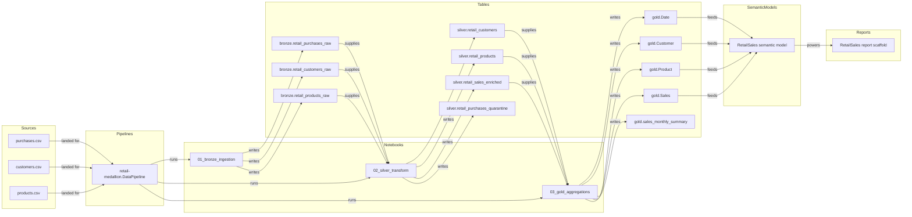

# Retail lineage diagram

> Generated from `artifacts/lineage-manifest.json` using `scripts/build_lineage.py`.

```mermaid
flowchart LR
    subgraph Sources
        purchases_csv["purchases.csv"]
        customers_csv["customers.csv"]
        products_csv["products.csv"]
    end
    subgraph Pipelines
        retail_medallion_pipeline["retail-medallion.DataPipeline"]
    end
    subgraph Notebooks
        notebook_01_bronze["01_bronze_ingestion"]
        notebook_02_silver["02_silver_transform"]
        notebook_03_gold["03_gold_aggregations"]
    end
    subgraph Tables
        bronze_retail_purchases_raw["bronze.retail_purchases_raw"]
        bronze_retail_customers_raw["bronze.retail_customers_raw"]
        bronze_retail_products_raw["bronze.retail_products_raw"]
        silver_retail_customers["silver.retail_customers"]
        silver_retail_products["silver.retail_products"]
        silver_retail_sales_enriched["silver.retail_sales_enriched"]
        silver_retail_purchases_quarantine["silver.retail_purchases_quarantine"]
        gold_date["gold.Date"]
        gold_customer["gold.Customer"]
        gold_product["gold.Product"]
        gold_sales["gold.Sales"]
        gold_sales_monthly_summary["gold.sales_monthly_summary"]
    end
    subgraph SemanticModels
        retailsales_semantic_model["RetailSales semantic model"]
    end
    subgraph Reports
        retailsales_report["RetailSales report scaffold"]
    end
    purchases_csv -->|landed for| retail_medallion_pipeline
    customers_csv -->|landed for| retail_medallion_pipeline
    products_csv -->|landed for| retail_medallion_pipeline
    retail_medallion_pipeline -->|runs| notebook_01_bronze
    notebook_01_bronze -->|writes| bronze_retail_purchases_raw
    notebook_01_bronze -->|writes| bronze_retail_customers_raw
    notebook_01_bronze -->|writes| bronze_retail_products_raw
    bronze_retail_purchases_raw -->|supplies| notebook_02_silver
    bronze_retail_customers_raw -->|supplies| notebook_02_silver
    bronze_retail_products_raw -->|supplies| notebook_02_silver
    retail_medallion_pipeline -->|runs| notebook_02_silver
    notebook_02_silver -->|writes| silver_retail_customers
    notebook_02_silver -->|writes| silver_retail_products
    notebook_02_silver -->|writes| silver_retail_sales_enriched
    notebook_02_silver -->|writes| silver_retail_purchases_quarantine
    silver_retail_customers -->|supplies| notebook_03_gold
    silver_retail_products -->|supplies| notebook_03_gold
    silver_retail_sales_enriched -->|supplies| notebook_03_gold
    retail_medallion_pipeline -->|runs| notebook_03_gold
    notebook_03_gold -->|writes| gold_date
    notebook_03_gold -->|writes| gold_customer
    notebook_03_gold -->|writes| gold_product
    notebook_03_gold -->|writes| gold_sales
    notebook_03_gold -->|writes| gold_sales_monthly_summary
    gold_date -->|feeds| retailsales_semantic_model
    gold_customer -->|feeds| retailsales_semantic_model
    gold_product -->|feeds| retailsales_semantic_model
    gold_sales -->|feeds| retailsales_semantic_model
    retailsales_semantic_model -->|powers| retailsales_report
```
